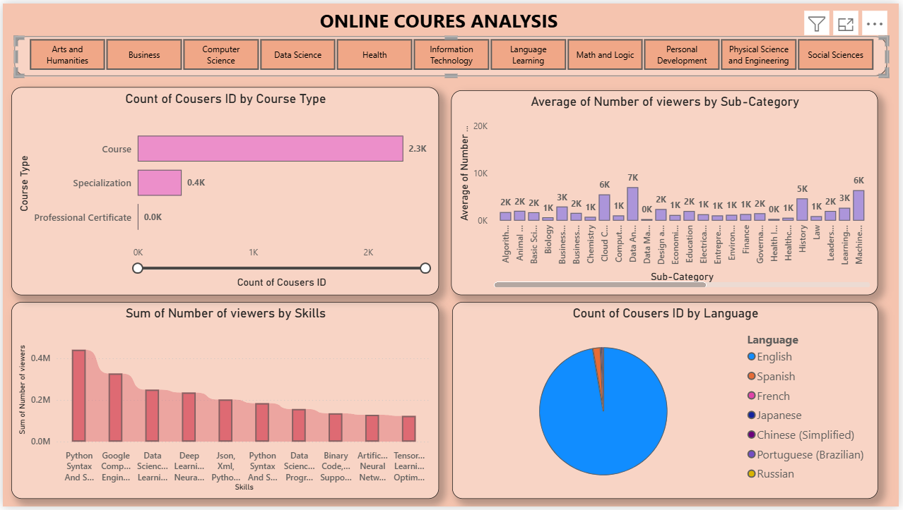
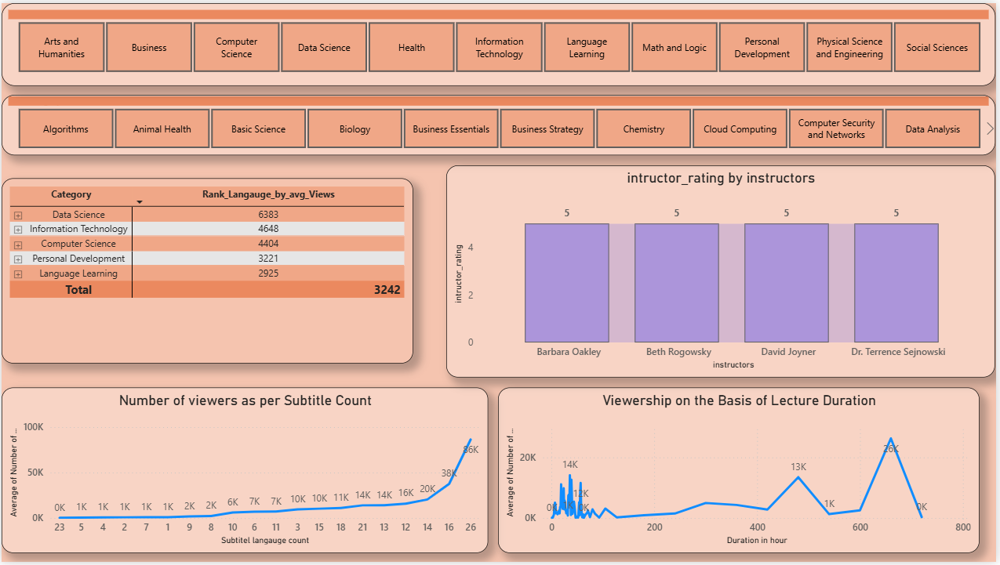
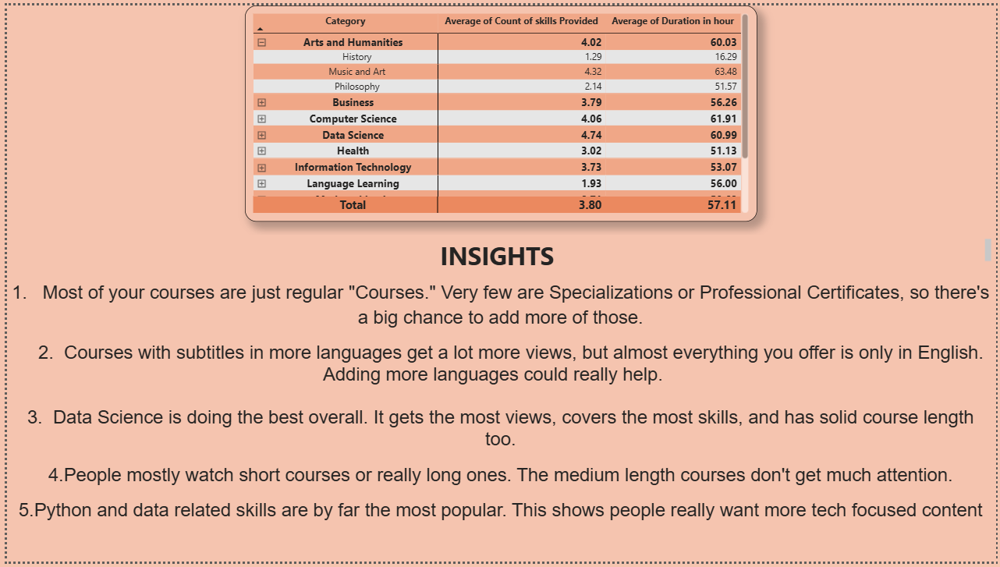

# Online Courses Analysis 📊

This is a Power BI dashboard project where I analyzed data from online courses to understand how learners engage with different categories, languages, skills, instructors, and course formats. The goal was simple — figure out what's working well and where there's room to grow.

I built this as a 3-page interactive report, with slicers for category and sub-category so anyone using it can filter down and explore the numbers that matter to them.

---

## What's inside the report

### Page 1 — Course Overview

This is the main landing view of the report. It breaks down courses by type (Course, Specialization, Professional Certificate), shows average viewers by sub-category, the top skills by total viewership, and the language split of the entire course catalog. It gives a quick snapshot of the overall course library before diving deeper.

### Page 2 — Engagement & Instructor Insights

This page looks at how viewers actually engage with the content. It ranks categories by average views, shows instructor ratings, and compares viewership against subtitle availability and course duration. This page is where some of the more interesting patterns showed up, especially around subtitles and how long a course is.

### Page 3 — Skills & Duration Summary

A category and sub-category wise breakdown of average skills taught per course and average course duration, along with a written summary of the key takeaways from the whole analysis.

---

## Key Insights

1. Most of the courses in the catalog are just regular "Courses." Very few are Specializations or Professional Certificates, so there's a good opportunity to build more of those.

2. Courses that offer subtitles in more languages tend to get a lot more views, but almost everything in the catalog is only available in English. Adding more language options could genuinely boost reach.

3. Data Science is the strongest performing category overall. It has the highest average views, covers the most skills per course, and also has a solid average duration.

4. Viewers mostly go for either short courses or really long, in-depth ones. Courses in the middle length range don't seem to get much attention.

5. Python and data-related skills are by far the most popular among learners, which shows a strong and ongoing demand for tech-focused content.

---

## Tools Used
- Power BI (data modeling, DAX measures, visuals)
- Excel (initial data cleaning)

---

Feel free to explore the `.pbix` file to see how the visuals and measures were built. Suggestions and feedback are always welcome!
